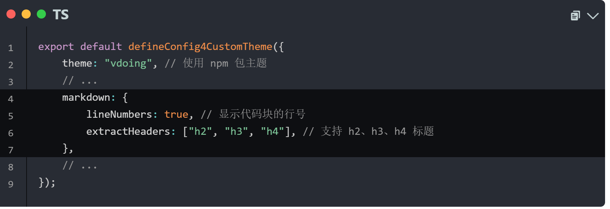

## 代码块折叠插件

## 安装

npm 

```bash
npm i vuepress-plugin-blocktoggle -D
```

yarn 

```bash
yarn add vuepress-plugin-blocktoggle -D
```

## 使用

```bash
// .vuepress/config.js

module.exports = {

//1. 引入iconfont样式
  head: [
    ['link', { rel: 'stylesheet', href: '//at.alicdn.com/t/font_3114978_qe0b39no76.css' }]
  ],

//2. 引入插件
  plugins: [
    'blocktoggle'
  ],

//3.开启行号
  markdown: {
    lineNumbers: true, // 显示代码块的行号
    extractHeaders: ["h2", "h3", "h4"], // 支持 h2、h3、h4 标题
  }
}
```


效果



目前只适配了同系列的[vuepress-plugin-copycodeblock](https://github.com/liyao52033/vuepress-plugins/blob/main/vuepress-plugin-copycodeblock)，与其他复制插件位置有所冲突，如需要复制代码块，请使用此插件
